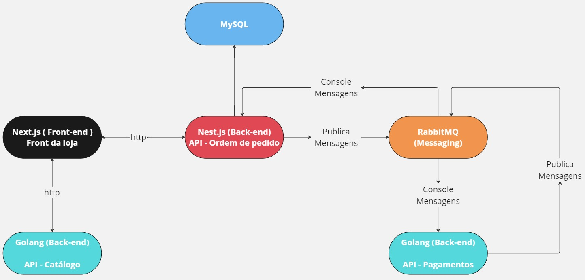

## Description - Project de E-commerce

This project is part of an e-commerce system with the following technologies:

### Technologies

- **Front-end:** <a href="https://github.com/LuizGustav0/nextjs-ecommerce" target="_blank">Next.js</a>
- **Back-end:**
  - **Orders:** <a href="https://github.com/LuizGustav0/nestjs-api-ecommerce-pedidos" target="_blank">Nest.js</a>
  - **Catalog:** <a href="https://github.com/LuizGustav0/go-api-ecommerce" target="_blank">Golang</a>
  - **Payments:** <a href="https://github.com/LuizGustav0/go-api-payments-ecommerce" target="_blank">Golang</a>
- **Messaging:** RabbitMQ
- **Database:** MySQL

### Project diagram

This diagram is essential for understanding the structure and communication between the different elements and/or microservices in the project. Check the repositories above and the ports where it is running.



### Order to run:

### **Catalog:** <a href="https://github.com/LuizGustav0/go-api-ecommerce" target="_blank">Golang</a>

### **Orders:** <a href="https://github.com/LuizGustav0/nestjs-api-ecommerce-pedidos" target="_blank">Nest.js</a>

### **Payments:** <a href="https://github.com/LuizGustav0/go-api-payments-ecommerce" target="_blank">Golang</a>

### **Front-end:** <a href="https://github.com/LuizGustav0/nextjs-ecommerce" target="_blank">Next.js</a>


## install dependences

```bash
go mod tidy

Run Docker

docker-compose up -d
```

## Access database

docker exec -it mysql mysql -u root -p

## Run service

```bash
cd cmd/catalog
go run main.go
```

install REST Client extension vs code
send request with -> test.http
